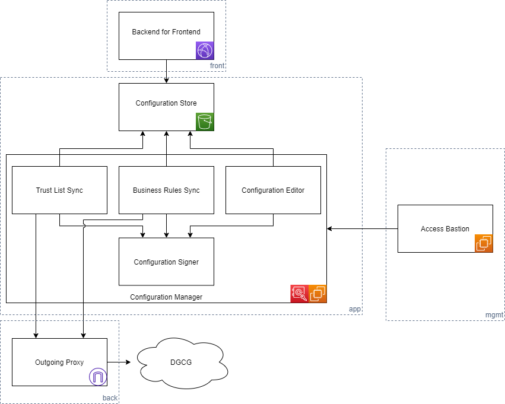
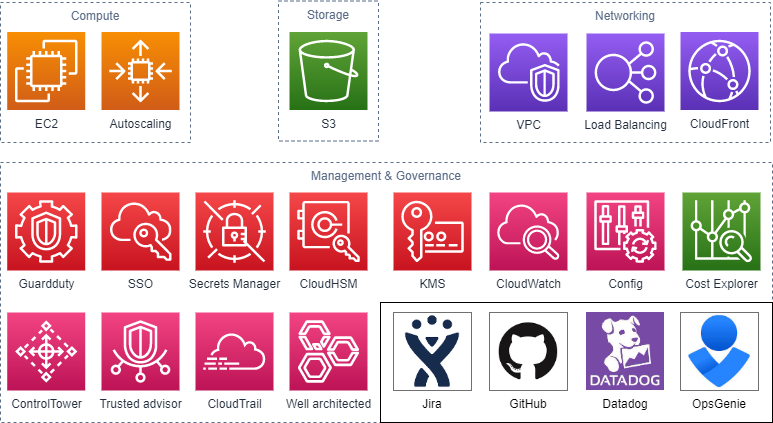

# NL COVID-19 CoronaCheck Cross Border Verification App - Backend

For cross-border compatible certicates a different verification app will be built in The Netherlands.

This verifier app will need to process the EU Digital COVID Certificate (DCC) from each country.

This document is a draft design for the backend needed for this verifier app. The backend is straightforward.

## Backend

A cross-border verifier backend is needed which provides read only APIs for this app to use:
* additional DCC specific verifier configuration as JSON beyond the [existing configuration](../api/README.md)
* access to a set of trusted DCC signing certs downloaded and cached from the [EU DGCG](https://github.com/eu-digital-green-certificates/dgc-gateway)
  * the DGCG has a custom cert-based authentication scheme
  * periodic refresh/download could be done using the MinVWS [DGCG command line tool](https://github.com/minvws/nl-covid19-coronacheck-app-dgcg-integration/tree/main/src/DigitalGreenGatewayTool)
* access to a set of DCC specific [business rules](https://github.com/ehn-dcc-development/dgc-business-rules) as JSON
  * periodic refresh/download must be done
  * assumption is these rules will also be provided via the DGCG with similar cert-based authentication
  * assumption is existing DGCG command line tool will have to be modified to download this JSON

The backend functionality is download-only and does not provide any holder data. It will be protected from adversaries through a CDN with security. Client IP addresses will not be stored beyond the minimum that is technically needed for the backend to function.

### Content signing

The security setup will mirror the existing CoronaCheck setup as much as possible to make it easy for the app developers to use the CoronaCheck backends alongside the Verifier app backend. This includes reusing the CMS signature setup ([backend PHP example](https://github.com/minvws/nl-covid19-coronacheck-app-bff/blob/main/app/Http/Middleware/CMSSignature.php)). The JSON responses will have a format

```
{
    "signature": "<blob>",
    "payload": "blob"
}
```
(TODO: what is the exact signing algo? Can the apps deal with multiple signers?)
(TODO: run a customized version of the existing CoronaCheck backend?)

### Hosting design

The runtime setup should be straightforward. Use of CDN should satisfy most availability and resiliency needs and excellent security is already mostly provided by the existing application architecture.

Draft example for an AWS environment:



By contrast, the hosting environment has relatively high security and management requirements - see the [Solution Architecture](../Solution%20Architecture.md) its guiding principles:



## App distribution

The cross-border verifier app is intended for use by border control and international transportation parties only. Non-international parties should use the standard verifier app.

Options to restrict who can use the cross-border verifier app:

### 1) Public app available, public app store download

This seems to be what at least Denmark is doing.

There will be no restriction on who can download the Dutch app that checks the DCC certificate. The app will be available in the public app store.

Users of the CoronaCheck app itself (and other EU apps) need to decide whom they allow to scan their DCC certificate.

Technically simplest.
Simplest management process.
No security risk.
Being implemented in other EU countries.
Recommended.

### 2) Central private app store

A private enterprise app store is set up for iOS and Android.

App is available only from this private enterprise app store.

Access to the private app store is restricted to users from authorized parties.

Main difficulty is how to restrict access to the app store to only the target users.

Technically advantage is dubious because it is unlikely to be provable that mobile devices will be under enterprise app management. App can still 'leak' through such unmanaged mobile devices.

Management process is dubious because delegating restricting users to the authorized parties will mean complex governance and verification of policies to check restriction to users.

### 3) Distributed private app stores

A secured download location is set up for downloading the app by admins from authorized parties.

Authorized parties place the verifier app in their private enterprise app store.

Access to each private enterprise app store is restricted by each authorized party to their users.

Technical advantage depends on ability of authorized parties to securely manage their app store. For well-managed app stores combined with enterprise mobile device management there is some chance of some control over app 'leaking'.

### 4) Public app available, app requires login

It is possible to build authentication/authorization so that only authenticated users can use the app.

Main difficulty is how to decide, administer and manage which users are authenticated.

An authentication system needs to be integrated and possibly set up for these users. eHerkenning and eIDAS would be logical candidates for such systems but their adoption is currently limited. It is unlikely significant populations of target users already have these authentication means. This may hinder adoption.

Technical advantage is there a plausible possibility to restrict access. Technical disadvantage is the app will need a network connection while authenticating.

Management process is plausible but will likely lead to implementation delay as use of the chosen authentication system would be a prerequisite for target users at authorized parties.


